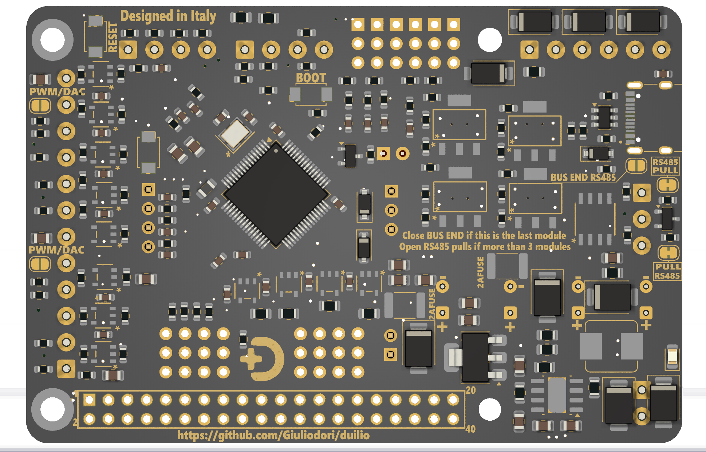

<p align="center">
  
</p>
              
<p align="center">
  
  &nbsp;&nbsp;&nbsp;
  
</p>


<p align="center">
  
  
  
  
  
  
</p>


# DUILIO F4 — Motion Control Board
Modular STM32F411-based motion control board for robotics and distributed systems
               
**Duilio F4** is a modular control board designed for robotics and remote control systems.   
It can be used:
- as a **standalone controller**
- as an **expansion board for Raspberry Pi**
- as part of a **distributed multi-board system** based on a robust communication bus

The board is designed to scale from simple projects to complex machines with many motors and peripherals.

---

## Status

**Duilio F4 hardware will be released soon.**

This repository will host:
- schematics, PCB and BOM
- firmware and configuration files
- documentation and examples

---

## Core concepts

Duilio F4 is built around these key ideas:

- modularity  
- scalability  
- robustness  
- ease of configuration  

The same board can be used in very different scenarios, from simple motor control to complex multi-axis systems.

---

## What Duilio F4 can do

### Standalone or Raspberry Pi HAT
Duilio F4 can operate:
- as a **standalone controller**
- as a **Raspberry Pi HAT**, directly mounted on the GPIO header

When used with Raspberry Pi, Duilio F4 can also **provide power to the Raspberry Pi**, simplifying system wiring.

---

### Motor control flexibility
Duilio F4 can control a wide range of motor drivers, including:

- DC motors (brushed)
- BLDC motor drivers
- common **PWM / DIR** drivers
- industrial motor drivers using enable, direction and speed signals

Examples of supported control modes:
- **speed limit control**
- **position control**
- mixed configurations (different modes on different motors)

---

### Multi-board systems and broadcast control
Multiple Duilio boards can be connected together using a **robust communication bus**.

- 10 or more boards can operate simultaneously
- commands can be sent in **broadcast mode**
- a single controller can manage multiple motors simultaneously

This architecture is suitable for complex robotic systems and distributed machines.

---

### Safety and reliability
Duilio F4 includes features designed for real-world use:

- **failsafe mechanisms**
- safe motor shutdown on communication loss
- predictable startup behavior
- separation between control logic and power stages

---

### Inputs and peripherals
The board supports a wide range of peripherals, including:

- RC radio receivers
- ultrasonic sonar sensors
- standard **RC servo outputs**
- digital and analog inputs for external sensors

---

## Typical use cases

Duilio F4 is designed to cover a wide range of real-world applications, including:

- **Mobile robots and autonomous platforms**  
  Control of multiple DC or BLDC motors, sensors and safety inputs in wheeled or tracked robots.

- **Remote-controlled machines**  
  Integration with RC receivers, PWM/DIR motor drivers and standard RC servos for remote operation.

- **Multi-axis systems**  
  Coordinated control of several motors in speed or position mode, even across multiple boards.

- **Distributed robotic systems**  
  Systems composed of many Duilio boards connected on a robust bus, with broadcast commands and centralized control.

- **Raspberry Pi based controllers**  
  Duilio F4 used as a Raspberry Pi HAT to offload real-time motor control and I/O handling.

- **Prototyping and custom machines**  
  A flexible platform for rapid development of custom robotic or mechatronic systems.

The same hardware and firmware can be reused across different projects, reducing development time and complexity.

---

## Duilio Tools (configuration software)

**Duilio Tools** is the official configuration and debug software.

It allows:
- board configuration with a few clicks
- parameter tuning without writing code
- real-time debugging and monitoring

Duilio Tools is designed so that **even users without specific programming knowledge** can:
- personalize the board
- adapt it to their application
- start using it immediately

The board ships with a **standard firmware**, but can be fully customized.

---

## For advanced users
Advanced users are free to:
- reflash the firmware
- modify the behavior of the board
- repurpose Duilio F4 for different applications

The platform does not lock users into a single use case.

---

## Planned repository structure

```text
duilio/
├── hardware/duilio-f4/   # Schematics, PCB, BOM
├── firmware/duilio-f4/   # Embedded firmware
├── tools/duilio-tools/   # Configuration and debug tools
└── docs/                 # Documentation and guides

---

© 2026 Fabio Giuliodori — Duilio Project

