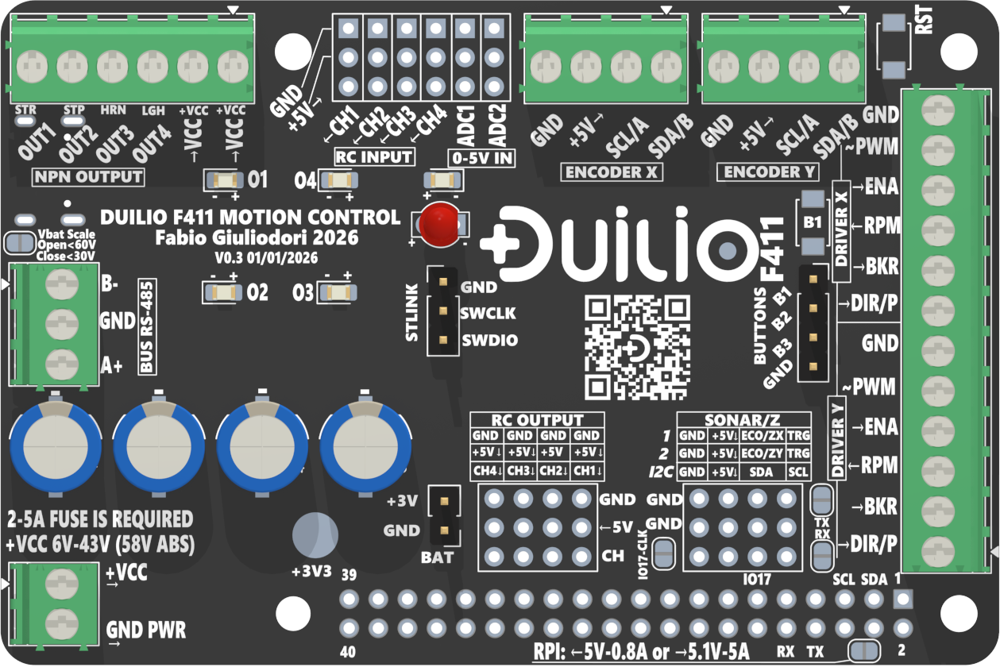
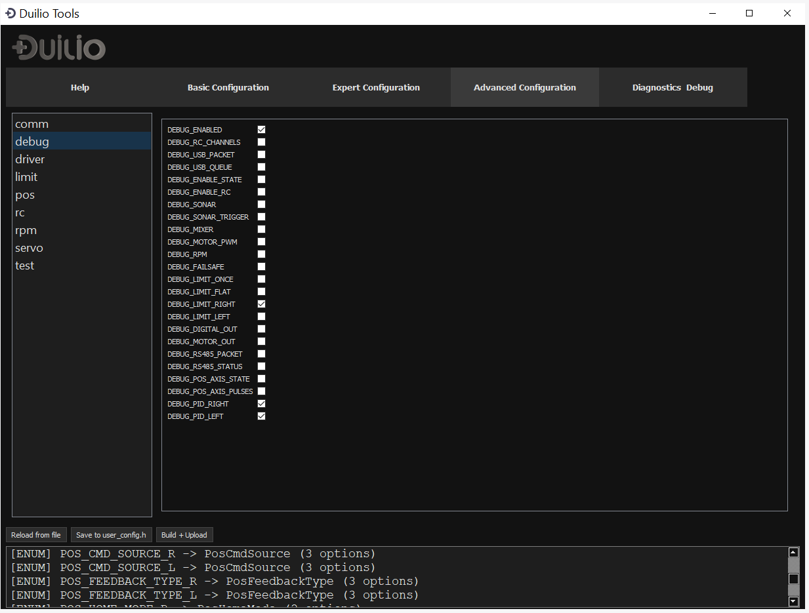
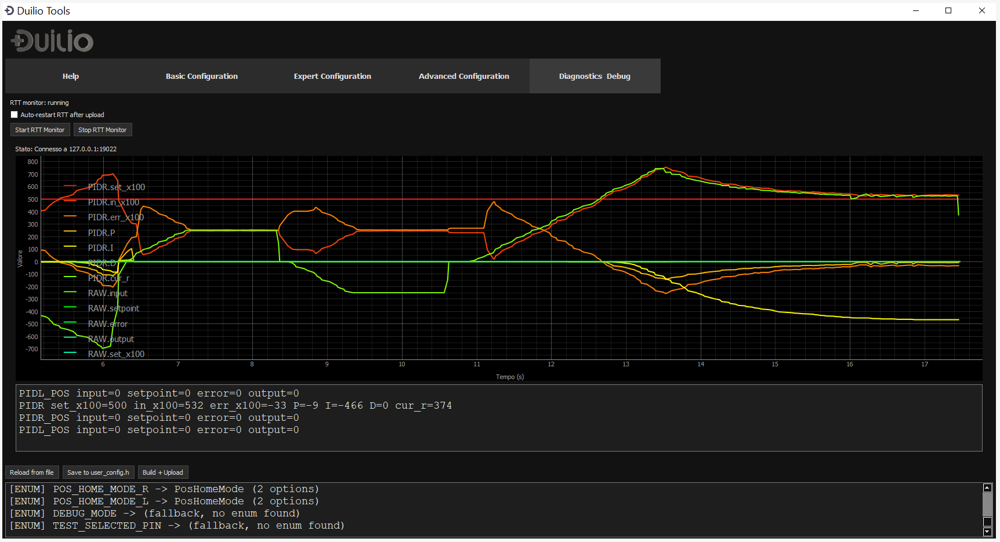

  

  

  
  
  
  
  
  

**Latest release:** v0.1.0  

# DUILIO F4 — Motion Control Board

📩 **info@duilio-project.it** · 🌐 **https://duilio.cc**

**DUILIO F4** is an **STM32-based motion control board** designed for **real machines and mobile robots**.  
It provides ready-to-use, profile-based firmware with **built-in safety and failsafe logic**, removing the need to reinvent motion control behavior in every project.

Duilio F4 connects directly to **RC receivers, USB hosts, Raspberry Pi and other SBCs**, and can **control multiple external motor drivers at the same time**.  
Motion behavior such as **ramps, limits, coordination and safe states** is handled on-board, independently of the host.

---

## What can you build with Duilio F4?

- **RC vehicles and machines**  
  Cars, boats, tracked vehicles, robotic platforms, remote lawn mowers.

- **Robots and mechatronic systems**  
  Differential drive, skid-steer, articulated mechanisms, linear actuators.

- **Custom servo motors of any power**  
  Turn **any motor + any driver** into a servo-like axis with limits, ramps and safety.

- **Rugged motion systems inspired by industrial practices**  
  Consistent and predictable motion behavior using hobby or industrial drivers.

---

## Motors and drivers

Motor- and driver-agnostic: works with different motors and external drivers using the same control logic.

If a motor driver can be controlled via **PWM, DIR, analog or RC-style signals**, Duilio F4 can manage it — including **multiple drivers simultaneously**.

---

## Why Duilio F4?

Driving a motor is easy.  
Making a machine **behave predictably and safely** is not.

Duilio F4 embeds motion control logic that usually gets rewritten from scratch:
- acceleration and deceleration ramps
- limits and soft limits
- axis coordination and mixing
- safety interlocks and failsafe behavior

**If you already have a motor driver, Duilio F4 turns it into real motion control.**

By handling motion logic and safety on-board, Duilio F4 often results in a **lower total system cost**:
- fewer external boards
- less custom firmware
- simpler wiring
- faster time to a working machine

---

## Example wiring — PWM/DIR motor driver (ZS-X11 style)

The diagram below shows a **typical and minimal wiring** between Duilio F4 and a PWM/DIR motor driver  
(ZS-X11–style logic, ENABLE + DIR + PWM).

This configuration applies to **many common motor drivers**, not only ZS-X11.

  

**Notes:**
- ENABLE is strongly recommended for failsafe behavior  
- PWM frequency and logic levels are configurable  
- The same wiring concept applies to many industrial and hobby drivers

---

## Example wiring — Servo-style / Dual-PWM driver with closed-loop positioning  
### (BTS7960 / IBT-2 + dual I²C absolute encoders)

This example shows a **closed-loop positioning setup** using Duilio F4 with:

- servo-style / dual-PWM motor drivers (BTS7960 / IBT-2)
- **two absolute I²C 14-bit encoders (MT6701)**
- **on-board PID control** for precise positioning

Each motor axis uses its own absolute encoder, enabling:
- precise position feedback
- repeatable homing without mechanical end-stops
- stable PID-controlled motion

  

**Notes:**
- Forward and reverse motion are handled by **two PWM signals**
- ENABLE remains available as a **global safety gate**
- The PID loop runs **locally on Duilio**, independent of the host
- Final accuracy depends on mechanics and encoder mounting

---

## Key features — overview

### Core platform
- **STM32F411 (Cortex-M4F)**
- Deterministic real-time motion control handled on-board
- Profile-based firmware (no application code required)

### Motion control
- **2 independent motor axes per board**
- Speed, position and torque control
- Built-in ramps, limits, coordination and safety behaviors

### Multi-driver & scalability
- Simultaneous control of **multiple external motor drivers**
- PWM/DIR, dual-PWM, STEP/DIR, analog (0–5 V), RC-style PWM
- **RS485 multi-drop bus** for distributed systems  
  *(example: 10 boards = 20 motors)*

### Host integration
- Works **standalone** via RC
- Or as a **companion controller** for Raspberry Pi, SBCs and PCs
- Clear role separation:  
  *Host = logic / UI / networking*  
  *Duilio = real-time motion and I/O*

### Safety & robustness
- Safe state on communication loss or fault
- Controlled startup and enable sequence
- Hardware and firmware interlocks
- Designed for noisy motor environments

---

## Status

- **Hardware:** third-generation prototype, multiple production iterations completed  
- **Firmware:** actively developed and tested on real hardware  
- **Duilio Tools:** operational and in active use, currently adapting to the 64-pin STM32 platform  

Documentation and software are published progressively as hardware validation advances.

---

## Real-world inspiration

Duilio F4 is the result of hands-on experience gained while building real machines and robotic platforms.

Some projects are documented here:
- ▶️ Remote-controlled mower (2WD) — https://youtu.be/Uh7IwvmYxhc  
- ▶️ Remote-controlled mower (4WD) — https://youtu.be/W-mF7ZH8-0U  
- ▶️ Trike — https://youtu.be/o_xk7uZkcA0  
- ▶️ Stroller — https://youtu.be/8yrex-ifpPg  
- ▶️ Shaker — https://youtu.be/M_itfUgND1k  

---

## Duilio Tools

**Duilio Tools** is the official configuration and debugging software.

It provides:
- guided board configuration
- parameter tuning without writing firmware code
- real-time monitoring and diagnostics
- advanced graphical debugging

  

  

Duilio Tools is designed so that **even users without programming knowledge** can configure and use the board effectively.  
Advanced users remain free to work directly with the firmware.

---

## Get involved / Early access

Duilio F4 is entering the final hardware validation phase.

You can get involved in two ways:

**1. Contribute to the project**  
Feedback on motion profiles, real-world testing, documentation and tools is welcome.

**2. Early access to the hardware**  
A limited number of **pre-production Duilio F4 boards** will be available for:
- beta testing on real machines
- early adopters and system integrators
- feedback-driven refinement

For the launch phase, the early access boards are expected to be available at a **very accessible price**.

📩 **info@duilio-project.it**  
🌐 **https://duilio.cc**

---

© 2026 Fabio Giuliodori — Duilio Project

